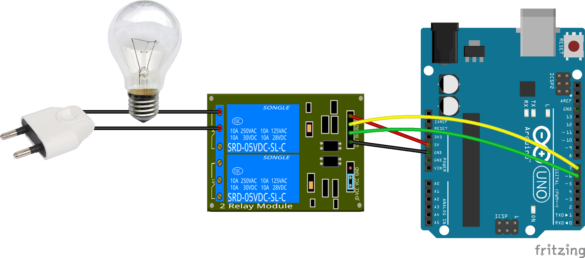
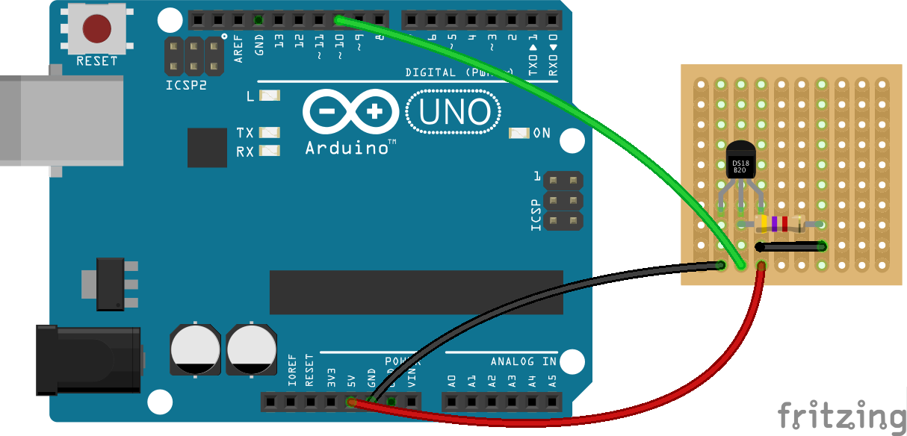

Arduino controller
========

This set of program allows one to order easily from a perl script an Arduino to switch on or off output pins which may be connected to a relay card and retrieve temperature from DS18B20 temperature sensors.

Find out more info (in french) at [my homepage](http://www.monbook.tech/realisations_arduino.html)

## Relay card

The Arduino is connected to the relay card with the power supply and output pins.
It can be used to switch on of off a lamp.



## Temperature

The sketch is also able to handle thermal sensors DS18B20 connected to pin number 10.



## Software

A perl script communicate through the emulated serial port with the Arduino with a simple exchange protocol to retrieve state and temperature and swith on or off ouputs. The Arduino listens for order and executes them.

### Arduino

Just load the sketch with the Arduino IDE and upload it.
Next, connect directly to the Arduino with a serial console.
On linux, just use picocom :
```shell
picocom /dev/ttyACM0 -b 9600
```

#### Welcome message

Like a shell, a prompt listen for inputs. To display the help, just type **h**.
```
> h
    ___          _       _
   / _ \        | |     (_)
  / /_\ \_ __ __| |_   _ _ _ __   ___
  |  _  | '__/ _` | | | | | '_ \ / _ \
  | | | | | | (_| | |_| | | | | | (_) |
  \_| |_/_|  \__,_|\__,_|_|_| |_|\___/

  Build Feb  7 2015 : 14:10:41

Help
Command available :
      <pin number [2-9]>=<0,1>
      h - help
      s - i/o status
      t - temperature
```

#### Output controller
To display the state of outputs, type **s**
```shell
> s
I/O Status :
  2 => 0
  3 => 0
  4 => 0
  5 => 0
  6 => 0 (R)
  7 => 0 (R)
  8 => 0 (R)
  9 => 0 (R)
```
The output 2 to 9 are listed and they are all in low (0) state.
For my needs, outputs connected to relay are inverted. The are identified with the `(R)` symbol.

In order to switch an output on or off, the command is composed from the output number followed by the sign = and with `1` (high) or `0` (low).
eg : switch on the output n°2 :
```shell
> 2=1
  OK
```

Check the state :
```shell
> s
I/O Status :
  2 => 1
  3 => 0
  4 => 0
  5 => 0
  6 => 0 (R)
  7 => 0 (R)
  8 => 0 (R)
  9 => 0 (R)
```

To setup pins output for relay, you'll need to edit sketch.ino to change the array accordingly.
* `0` is normal output
* `1` is for inverted output

```C
// pin 6 - 9 are connected to relay
const int relays[NB_OUTPUT] = {0,0,0,0,0,0,1,1,1,1};
```

#### Temperature

In order to display the temperature, type **t**. The program look for any thermal sensors DS18B20 connected to it, for each found, it request the temperature and displays it in Celsius.
```shell
> t
Temperature :
ROM = [ 28 A 4C 3B 4 0 0 5B ] - Temperature : 12.69 °C
ROM = [ 28 6 AD 33 4 0 0 2D ] - Temperature : 15.94 °C
```

### Perl

The perl script handles the communication described above and offer a cli usage.

Thoses scripts requires the following perl lib : `libdevice-serialport-perl` and `libconfig-simple-perl`.

#### Outputs controller

It handles the communication with the Arduino with the protocol stated before, displays and change the state of the desired output.

Usage :
```shell
> ./pin.pl
./pin.pl [-p dev] (<pin> <state> | status)
        <dev>   - device [/dev/ttyACM0]
        status  - retrieve the current status of the outputs
        <pin>   - pin number
        <action> - low|off / high|on / toggle
```

Display the state of output, like above :
```shell
> ./pin.pl status
Status
  2 => 1
  3 => 0
  4 => 0
  5 => 0
  6 => 0 (R)
  7 => 0 (R)
  8 => 0 (R)
  9 => 0 (R)
```

Swith on the output number 2
```shell
> ./pin.pl 2 on
```

toggle an output
```shell
> ./pin.pl 2 toggle
```

#### Temperature

This script retrieves the temperature of all DS18B20 sensors connected to the Arduino and logs it in a file named ```temperature.<date>.log``` in the folder ```/var/lib/temperature/```. One line per invocation at the end of the file.
The date is formatted as ```%Y-%m-%d```.
It also reads a configuration file ```/etc/arduino.cfg``` in order to provide a name for the 64 bit adresses of thermal sensors.
The file looks like this :
```
sensor1=28 A 4C 3B 4 0 0 5B : ext. nord
sensor2=28 6 AD 33 4 0 0 2D : garage
```

and when the line added to the file is :
```
2015-10-13 00:00:05 : ext. nord=11.13 - garage=14.88 -
```

Usage :
```shell
> ./temperature.pl
./temperature.pl usage:
        -d : debug output
```
