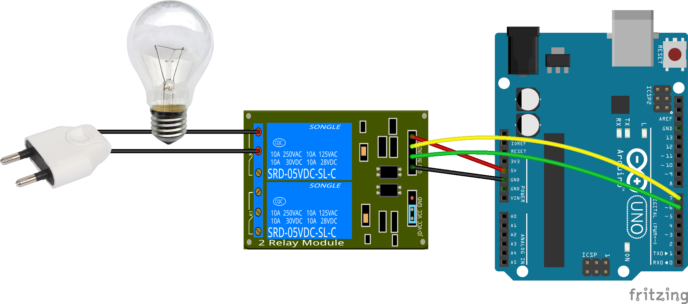

Arduino controller
========

This set of program allows one to order easily from a perl script an arduino to switch on or off output pins which may be connected to a relay card and retrieve temperature from DS18B20 temperature sensors.

Find out more info (in french) at [my homepage](http://www.monbook.tech/realisations_arduino.html)

## Relay card

The arduino is connected to the relay card with the power supply and output pins.
It can be used to switch on of off a lamp.



## Software

A perl script communicate through the emulated serial port with the Arduino with a simple exchange protocol to retrieve state and temperature and swith on or off ouputs. The arduino listens for order and executes them.

### Arduino

Just load the sketch with the arduino IDE and upload it.
Next, connect directly to the arduino with a serial console.
On linux, one can use picocom :
```shell
picocom /dev/ttyACM0 -b 9600
```

Like a shell, a prompt listen for inputs. To display the help, just type **h**.
```
> h
    ___          _       _
   / _ \        | |     (_)
  / /_\ \_ __ __| |_   _ _ _ __   ___
  |  _  | '__/ _` | | | | | '_ \ / _ \
  | | | | | | (_| | |_| | | | | | (_) |
  \_| |_/_|  \__,_|\__,_|_|_| |_|\___/

  Build Feb  7 2015 : 14:10:41

Help
Command available :
      <pin number [2-9]>=<0,1>
      h - help
      s - i/o status
```

To display the state of the output, type **s**
```shell
> s
I/O Status :
  2 => 0
  3 => 0
  4 => 0
  5 => 0
  6 => 0 (R)
  7 => 0 (R)
  8 => 0 (R)
  9 => 0 (R)
```
The output 2 to 9 are listed and they are all in low (0) state.
For my needs, outputs connected to relay are inverted. The are identified with the `(R)` symbol.

In order to switch an output on or off, the command is composed from the output number followed by the sign = and with `1` (high) or `0` (low).
eg : switch on the output n°2 :
```shell
> 2=1
  OK
```

Check the state :
```shell
> s
I/O Status :
  2 => 1
  3 => 0
  4 => 0
  5 => 0
  6 => 0 (R)
  7 => 0 (R)
  8 => 0 (R)
  9 => 0 (R)
```

### Perl

The perl script handles the communication described above and offer a little more features.

Usage :
```shell
> ./pin.pl
./pin.pl [-p dev] (<pin> <state> | status)
        <dev>   - device [/dev/ttyACM0]
        status  - retrieve the current status of the outputs
        <pin>   - pin number
        <action> - low|off / high|on / toggle
```

Display the state of output, like above :
```shell
> ./pin.pl status
Status
  2 => 1
  3 => 0
  4 => 0
  5 => 0
  6 => 0 (R)
  7 => 0 (R)
  8 => 0 (R)
  9 => 0 (R)
```

Swith on the output number 2
```shell
> ./pin.pl 2 on
```

toggle an output
```shell
> ./pin.pl 2 toggle
```
